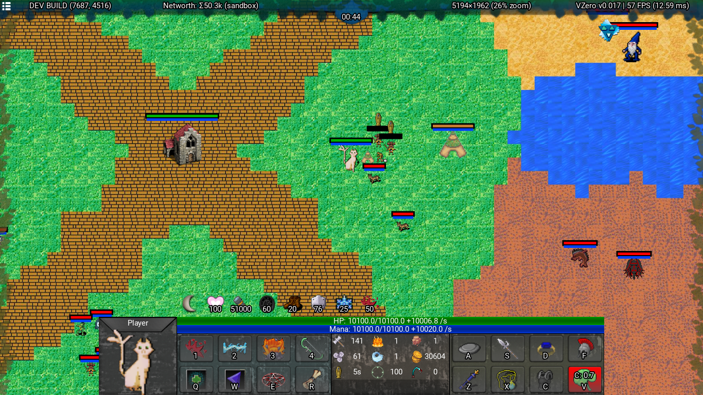
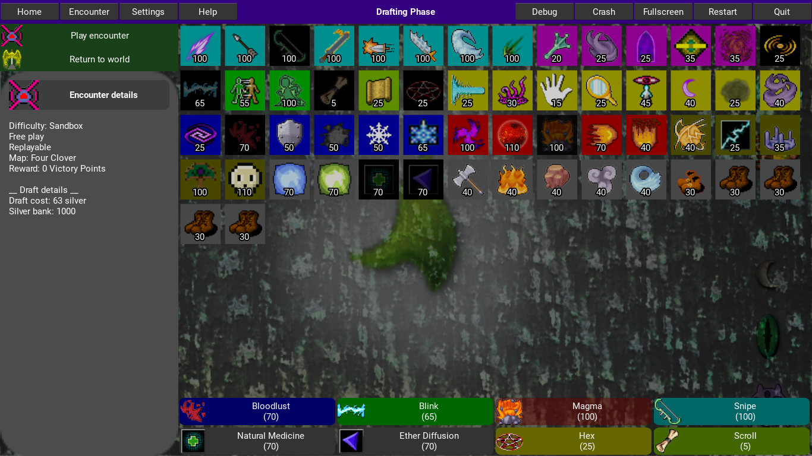

# VZero
VZero is an open-source real-time action game written entirely in Python and [Kivy](https://kivy.org/).

The game is heavily inspired by a DotA2 mod named "Legends of Dota", where one could combine any loadout of the many abilities available (normally each fixed to a single hero). This allows for lots of creativity and discovering "broken" combinations of abilities.

#### Gameplay animated preview

#### Gameplay screenshot

#### Pregame menu

## Playing the game
A release was made for Windows users, see the [GitHub releases page](https://github.com/ArielHorwitz/VZero/releases).
Instructions may be lacking, but be sure to check out the hotkeys in the settings menu.

## Running from source
Requires Python 3.9, and then: `pip install -r requirements.txt`

## Open source
The project has been open sourced, with the hope to inspire people to develop cool stuff in Python. Anything I have authored (the code) is hereby released to the public domain. The repository includes many assets that themselves have been released to the public domain.

## Artwork
All of the artwork (both visual and audio) was contributed directly or collected via [OpenGameArt](https://opengameart.org) from generous artists who have contributed to the public domain. Credits include but are not limited to:
- [Yisrael Hessler](https://github.com/imcrazeegamer)
- [Orr Didi](https://scardust.co)
- [Kenney](https://kenney.itch.io/)
- [7Soul1](https://www.deviantart.com/7soul1)
- [Dungeon Crawl Stone Soup](https://opengameart.org/content/dungeon-crawl-32x32-tiles-supplemental)
- And many more...
